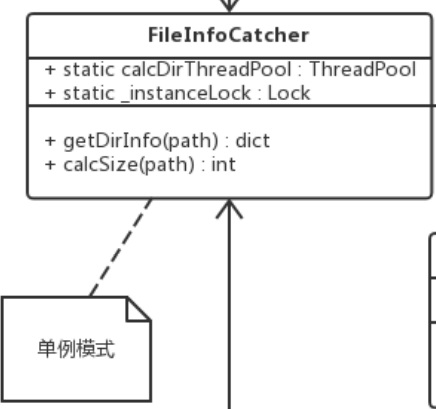
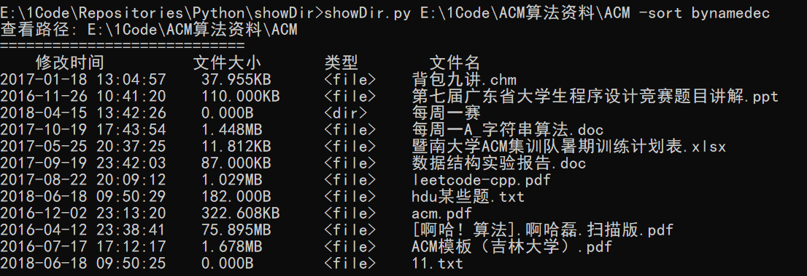
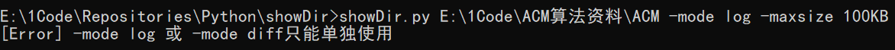

## 项目需求

### 1.1 基本功能

-   用戶可在文件系統中任意查看不同目錄，某一目錄中的所有文件可以不同的排序依據排列，排序依據包括：文件名，文件大小，修改時間。

-   用OO(Object Oriented)範式實現如下函數：

>   **int scandir**( *dirName*, *fileList*, *selectCriteria*, *compare* )

>   該函數首先讀取目錄 *dirName* 中的所有文件，但祗選取滿足謂詞 *selectCriteria*
>   的所有文件，并按照 *compare*
>   指定的方式進行排序後將所選取的文件存入列表*fileList*中。注意：存入
>   *fileList*
>   中的每個文件都是一個對象，包含此文件的種種信息（但不包括該文件的內容），而非僅僅是文件名而已。

### 1.2 扩展功能

程序可進入兩種模式：日誌模式及差異模式，描述如下：

-   日誌模式：在日誌模式中程序遞歸地遍歷某目錄樹，以部分永久存儲的方式記錄所遍歷的文件信息。

-   差異模式：在差異模式中程序遞歸地遍歷某目錄樹，將之與之前在日誌模式中所記錄的該目錄樹的文件信息相比較，顯示二者所有的差異。在顯示差異時，若某目錄在日誌產生之後被刪除或被創建，則祗需顯示該目錄名，而不必顯示該目錄的內容。

說明：本程序在Windows或Linux下實現均可。

### 1.3 实现要求

-   使用學過的設計模式（若學有餘力，亦可應用課堂未講過的設計模式）改進你的設計

    -   1）畫出應用模式之後的設計類圖，并闡述每個類、每個方法的目的及作用，至少讓他人可以大致明白你的設計；

    -   2) 每個所應用的模式都要在系統設計類圖中加以標註及文字說明，譬如哪個類是
        Strategy
        模式中的host，哪個類是algorithm等等；闡述你為何要使用該模式，好處何在,
        可能帶來的壞處是什麼。

-   因大多數高級語言已經內置文件系統的訪問功能，請不要使用高級類庫、框架完成課程項目，否則就喪失了大部分鍛煉價值。

## 設計類圖

### 2.1 設計類圖

#### 2.1.1 設計類圖描述

-   **OodleApp應用主程序類：**

    1.  成員變量queryPath : 保存查看的目錄路徑

    2.  成員變量 option : 操作選項列表

    3.  成員變量 fileInfo : 目錄的文件信息

    4.  成員函數 run : 主程序運行

**注**: 2) 成員變量 option : 操作選項列表如下

-   **OptionParser 選項解析類:**

    1.  靜態成員變量 **optionTypeOrder** :
        選項類型順序表，用於優化和調整選項操作的執行順序，如篩選操作比排序操作優先執行（這樣可以減少排序數量，提高效率）。該變量使用“數據驅動”來獲取封閉性。

    2.  靜態方法 \__check() : 初步檢查選項個數、選項語法的正確性

    3.  靜態方法 parse() :
        將選項字符串解析成以二元組為元素的操作選項列表，并返回優化和調整后的列表

-   **ThreadPool 線程池類(池模式):**

    1.  成員函數 makeRequests(callable_,args_list,callback=None) :
        用於創建任務。

    2.  成員函數 putRequest(request, block=True, timeout=None) :
        用於將創建出來的任務加入到任務列表中

    3.  成員函數 wait() : 阻塞主線程，等待所有任務被完成

-   **FileInfoCatcher 文件信息獲取者(單例模式):**

    1.  靜態成員變量 calcDirThreadPool :
        用於計算目錄大小的線程池，線程池大小為10

    2.  靜態成員變量 \_instanceLock : 線程鎖，保證單例模式在多線程中的安全性

    3.  成員函數 getDirInfo(path) : 獲取指定目錄下的文件(目錄)信息，返回一個字典

    4.  成員函數 calcSize(path) : 計算指定path的文件(目錄)大小

-   **OptionFactory 選項工廠(工廠模式)**:

    1.  成員函數 createOption(option) : 根據option字符串創建相應的Option對象

-   **Option 選項抽象類(命令模式):**

    1.  成員函數 execute(obj) : 命令執行

-   **Options(組合模式 迭代器模式):**

    1.  成員變量 optionList : 保存著Option對象的List表

    2.  成員函數 execute(obj) :
        使用迭代器執行optionList中所有元素的execute(obj)函數

-   **CalcDirSizeOption 計算目錄大小選項類:**

    1.  成員函數 execute(obj) :
        使用FileInfoCatcher類提供的計算方法以及線程池計算文件(目錄)大小

-   **HelpOption 幫助選項:**

    1.  成員函數 execute(obj) : 輸出選項操作幫助信息

-   **NameIncludeOption** 正則表達式查找相匹配文件名的文件

    1.  成員函數 execute(obj) : 利用正則表達式來篩選匹配的文件名的文件

-   **SizeOption** 大小選項類:

    1.  **MaxSizeOption** 文件大小上限選項 : 設置查找的文件大小的上限

    2.  **MinSizeOption** 文件大小下限選項 : 設置查找的文件大小的下限

-   **SortOption** 排序選項類:

    1.  **SortByNameOption** 按文件名進行升序或降序排序

    2.  **SortByModifyTime** 按文件修改時間進行升序或降序排序

    3.  **SortBySizeOption** 按文件大小進行升序或降序排序

-   **ModeOption** 模式選項

    1.  **LogModeOption** 日誌模式選項， 將查看的目錄信息保存為日誌

    2.  **DiffModeOption** 差異模式選項， 與過去的日誌進行比較，顯示差異

### 2.2 設計模式

#### 2.2.1 單例模式

##### 2.2.1.1 涉及的類圖

##### 2.2.1.2 涉及的代碼

##### 2.2.1.3 好處

1. 由於FileInfoCatcher類功能僅是獲取目錄信息以及計算文件（目錄）大小，
且是被外界經常使用的，同時並不需要多個實例對象即可完成功能，所以使用單例模式可以控制該實例對象的數目，節約系統資源；

2. 該對象需要被外界使用，相對於定義一個全局變量來說，使用單例模式能防止實例化多個對象；

##### 2.2.1.4 壞處

1. 虽然数量很少，但如果每次对象请求引用时都要检查是否存在类的实例，将仍然需要一些开销

##### 2.2.1.5 設計原則

1. 單一職責原則 ： 只做文件信息獲取工作，計算目錄大小也是文件信息獲取的體現

#### 2.2.2 池模式

##### 2.2.2.1 涉及的類圖

##### 2.2.2.2 好處

1. 由於計算某個目錄下的子目錄文件大小需要遞歸遍歷子目錄才能計算，如果每次只能計算一個子目錄的大小，則效率低下，所以使用線程池模式，每次同時計算多個子目錄的大小，提高效率。

2. 線程的重用：線程的創建和銷毀的開銷是巨大的，通過線程池進行線程的重用可以大大減少不必要的開銷，
提高效率。

##### 2.2.2.3 壞處

1. 可能存在線程洩露的風險，当从池中除去一个线程以执行一项任务，而在任务完成后该线程却没有返回池时，会发生这种情况；

2. 請求過載，當所要執行的任務過多時，程序所需要的運行時間就長，導致佔用大量系統資源。

##### 2.2.1.4 設計原則

1. 單一職責原則： 線程池只做線程調度工作，控制池內的線程。

#### 2.2.3 工廠模式

##### 2.2.2.1 涉及的類圖

##### 2.2.2.2 好處

1. 降低耦合度，把对象的创建和使用的过程分开。

2. 降低代码的复杂度，提高代码的重用性。

3. 方便后续Option对象的添加和修改。

##### 2.2.1.3 設計原則

1. 單一職責原則：OptionFactory只生產Option對象

2. 開閉原則： Option對象的增加只需要在工廠中增加相應的生成代碼。

3. 依賴倒置原則：工廠生成的Option對象依賴於抽象的Option類，而不依賴於具體的Option類

#### 2.2.4 命令模式

##### 2.2.2.1 涉及的類圖

##### 2.2.2.2 好處

1.Option選項有多種，後續可能還會添加更多的Option選項，使用命令模式來構建Option選項，可以滿足“開閉原則”，而不去修改調用者的代碼。

2. Option選項每一個都相當於一條命令，意義直接明了。

##### 2.2.2.3 壞處

1. 使用命令模式會增加系統的複雜性， 導致系統的類數目增加。

##### 2.2.1.4 設計原則

1. 開閉原則：增加新的具體命令時，不需要修改調用者的代碼，只需要新增相應的類和工廠生成方法即可。

2. 單一職責原則： 命令模式的每條命令只干一件事。

#### 2.2.5 組合模式和迭代器模式

##### 2.2.2.1 涉及的類圖

##### 2.2.2.2 好處

1. 因為Option選項集可能會有很多，一個一個管理Option太麻煩且複雜，而使用組合模式來表示一個Option選項集，可以方便地使用Option。

##### 2.2.2.3 壞處

1. 透明性較差，別的Option派生類中並沒有addOption這個方法，使用addOption這個方法時，客戶需要先判斷這個對象是不是Options對象。

## 3. 重構模式

### 3.1 Extract Method

最初获取文件(目录)文件信息的方法是在OodleApp类中实现的，但由于CalcDirSizeOption,
LogModeOption, DiffModeOption均需要用到获取文件(目录)文件信息的方法，
所以将其提取出来作为FileInfoCatcher类来进行使用；

### 3.2 Replace Nested Conditional with Guard Clauses

将嵌套条件语句改成非嵌套的条件语句，是逐层往下的。

### 3.3 Separate Query for Modifier

将多职责的方法分成多个单职责的方法。

### 3.4 Replace Conditional with Polymorphism

使用多态来替换条件分支语句。

## 4 程序运行

-   **不加选项的查看**

-   **排序选项**

    -   按文件名升序排序

-   按文件名降序排序

-   按文件大小升序排序

-   按文件大小降序排序

-   按文件修改时间升序排序

-   按文件修改时间降序排序

-   **文件名筛选**

注：正则语法是python的正则语法

-   **文件大小筛选**

-   **允许计算子目录大小**

-   **日志模式与差异模式**

-   **多个选项混合使用**

-   **错误选项输入提示**

